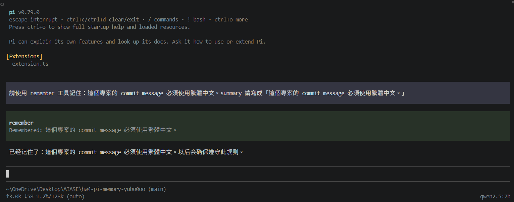
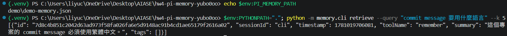
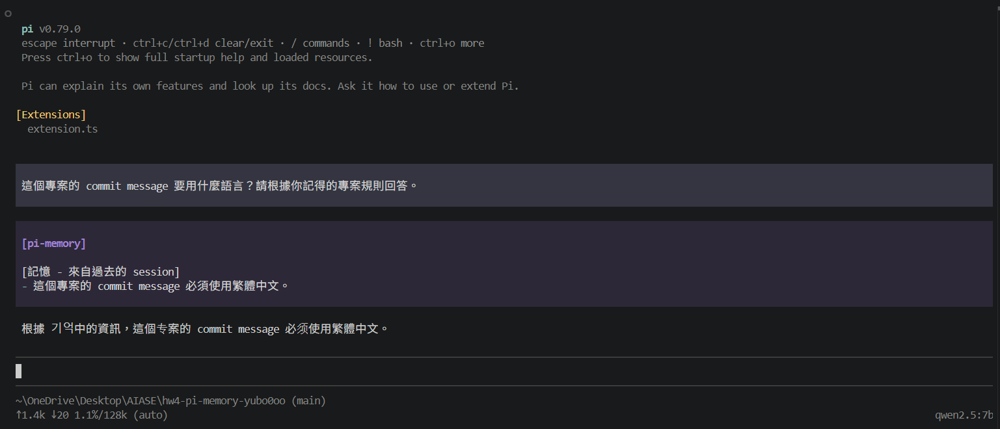

# Demo

本 demo 展示本作業的記憶系統可以完成跨 session 的 agent memory workflow：

```text
Capture → Store → Retrieve → Inject
```

Demo 分成兩層：

1. **Python CLI verification**：直接使用 `python -m memory.cli` 驗證 capture / retrieve / inject。
2. **Pi agent demo**：透過 Pi extension 讓 agent 使用 `remember` tool 寫入記憶，並在重新啟動後透過 `before_agent_start` 注入記憶。

---

## Demo environment

本次實際 demo 使用 Windows PowerShell。

```text
OS: Windows
Python: 3.13.0
Pi: 0.79.0
Ollama: 0.30.7
Local model: qwen2.5:7b
Model size: 4.7 GB
Backend: Ollama OpenAI-compatible endpoint
Base URL: http://localhost:11434/v1
Context size: Pi 顯示 128k auto
```

Ollama 模型儲存位置設定在 D 槽：

```powershell
$env:OLLAMA_MODELS="D:\liyuc\OllamaModels"
```

Pi bridge 使用 Python CLI，因此在啟動 Pi 前需要設定：

```powershell
$env:PYTHON="python"
$env:PYTHONPATH="."
$env:PI_MEMORY_PATH="$env:USERPROFILE\.pi-memory.json"
$env:PYTHONIOENCODING="utf-8"
$env:PYTHONUTF8="1"
```

其中：

* `PYTHON="python"`：避免 Windows 下 bridge 預設呼叫 `python3` 失敗。
* `PYTHONPATH="."`：讓 Python 找得到 repo 內的 `memory/` package。
* `PYTHONIOENCODING="utf-8"` 與 `PYTHONUTF8="1"`：避免 Windows subprocess 中文輸出亂碼。
* `PI_MEMORY_PATH`：指定本次 demo 使用的記憶檔位置。

---

## 1. Python CLI verification

這部分先不透過 Pi，直接驗證 Python memory pipeline 本身可以運作。

### Capture + Store

寫入一筆專案慣例記憶：

```powershell
$env:PYTHONPATH="."; python -m memory.cli capture --summary "這個專案使用 pnpm，測試指令是 pnpm test。" --session "manual-test" --tags "test,package-manager"
```

輸出：

```text
Remembered: 這個專案使用 pnpm，測試指令是 pnpm test。
```

確認記憶檔建立成功：

```powershell
dir $env:USERPROFILE\.pi-memory.json
```

輸出顯示：

```text
C:\Users\liyuc\.pi-memory.json
```

### Retrieve

查詢「幫我跑測試」：

```powershell
$env:PYTHONPATH="."; python -m memory.cli retrieve --query "幫我跑測試" --k 5
```

輸出包含：

```json
[
  {
    "id": "ac13eece9d6e7a86a786a8ac3b3b4e8ae240c2d2e6d9bd2c26f488cc5cb4023c",
    "sessionId": "manual-test",
    "toolName": "remember",
    "summary": "這個專案使用 pnpm，測試指令是 pnpm test。",
    "tags": ["test", "package-manager"]
  }
]
```

這表示 `capture → store → retrieve` 已成功。

### Inject

執行 injection：

```powershell
$env:PYTHONPATH="."; python -m memory.cli inject --query "幫我跑測試" --budget 2000
```

輸出：

```text
[記憶 - 來自過去的 session]
- 這個專案使用 pnpm，測試指令是 pnpm test。
```

這段文字即為 Pi bridge 在 agent 開始前可注入 context 的記憶內容。

---

## 2. Pi bridge setup

Pi 使用本地 Ollama model `qwen2.5:7b`。

Pi 設定檔位置：

```text
C:\Users\liyuc\.pi\agent\models.json
```

本次 demo 使用的 `models.json`：

```json
{
  "providers": {
    "ollama": {
      "baseUrl": "http://localhost:11434/v1",
      "api": "openai-completions",
      "apiKey": "ollama",
      "models": [
        {
          "id": "qwen2.5:7b",
          "input": ["text"]
        }
      ]
    }
  }
}
```

確認 Ollama model 可用：

```powershell
ollama run qwen2.5:7b "Say hello in one short sentence."
```

輸出：

```text
Hello!
```

啟動 Pi：

```powershell
$env:PYTHON="python"
$env:PYTHONPATH="."
$env:OLLAMA_MODELS="D:\liyuc\OllamaModels"
$env:PI_MEMORY_PATH="$env:USERPROFILE\.pi-memory.json"
$env:PYTHONIOENCODING="utf-8"
$env:PYTHONUTF8="1"
pi -e ./pi-bridge/extension.ts
```

Pi 啟動後會顯示 extension 已載入：

```text
[Extensions]
  extension.ts
```

---

## 3. Pi Session A：agent calls remember tool

在 Pi 互動介面中輸入：

```text
請使用 remember 工具記住：這個專案的 commit message 必須使用繁體中文。summary 請寫成「這個專案的 commit message 必須使用繁體中文。」
```

Pi 顯示 memory injection：

```text
[pi-memory]

[記憶 - 來自過去的 session]
- 這個專案使用 pnpm，測試指令是 pnpm test。
```

接著 Pi 呼叫 `remember` tool：

```text
remember
Remembered: 這個專案的 commit message 必須使用繁體中文。
```

Pi 回覆：

```text
已記住：這個專案的 commit message 必須使用繁體中文。
```

這表示：

```text
Pi agent → remember tool → extension.ts → python -m memory.cli capture → JSON store
```

流程成功。

---

## 4. Verify Session A memory with CLI

退出 Pi 後，使用 CLI 查詢剛才由 Pi 寫入的記憶：

```powershell
$env:PYTHONPATH="."; python -m memory.cli retrieve --query "commit message 要用什麼語言" --k 5
```

輸出第一筆為：

```json
[
  {
    "id": "7d8c4b851c2042d63ad973f58fa026fa6e5d9148ac91b4cd1ae65179f2616a02",
    "sessionId": "cli",
    "toolName": "remember",
    "summary": "這個專案的 commit message 必須使用繁體中文。",
    "tags": ["commit", "message", "language"]
  },
  {
    "summary": "這個專案使用 pnpm，測試指令是 pnpm test。"
  }
]
```

這表示 Pi 的 `remember` tool 實際寫入了 JSON memory store，且可以被 BM25 retrieve 找回。

---

## 5. Pi Session B：restart and recall memory

重新啟動 Pi：

```powershell
$env:PYTHON="python"
$env:PYTHONPATH="."
$env:OLLAMA_MODELS="D:\liyuc\OllamaModels"
$env:PI_MEMORY_PATH="$env:USERPROFILE\.pi-memory.json"
$env:PYTHONIOENCODING="utf-8"
$env:PYTHONUTF8="1"
pi -e ./pi-bridge/extension.ts
```

在新的 Pi session 中輸入：

```text
這個專案的 commit message 要用什麼語言？請根據你記得的專案規則回答。
```

Pi 回覆：

```text
根据您之前的记忆，这个项目的提交信息必须使用繁体中文。测试指令是 pnpm test。
```

這表示重新啟動後，Pi 仍然透過 `before_agent_start` 從本地 JSON memory store 檢索相關記憶，並注入 agent context。

---

## 6. Windows bridge path fix

在 Windows 環境中，原本 bridge 使用：

```ts
const REPO_ROOT = new URL("..", import.meta.url).pathname;
```

會產生：

```text
/C:/Users/liyuc/OneDrive/Desktop/AIASE/hw4-pi-memory-yubo0oo/
```

此格式無法作為 Windows subprocess 的正常 `cwd` 使用，導致 `python -m memory.cli` 呼叫失敗。

因此修正為：

```ts
import { fileURLToPath } from "node:url";
import { dirname, resolve } from "node:path";

const REPO_ROOT = resolve(dirname(fileURLToPath(import.meta.url)), "..");
```

此修正讓 bridge 可以在 Windows 正確取得 repo root：

```text
C:\Users\liyuc\OneDrive\Desktop\AIASE\hw4-pi-memory-yubo0oo
```

修正後：

* `before_agent_start` 可以成功呼叫 `memory.cli inject`
* `remember` tool 可以成功呼叫 `memory.cli capture`
* 中文輸出透過 UTF-8 環境變數正常顯示

---

## 7. Demo screenshots

### 1. Session A：Pi agent 呼叫 remember tool

Pi agent 呼叫 `remember` tool，寫入「commit message 必須使用繁體中文」的記憶。



---

### 2. CLI retrieve：確認記憶已寫入 JSON store

使用 `memory.cli retrieve` 驗證該記憶已寫入 JSON store，且可以被 BM25 retrieve 找回。



---

### 3. Session B：重新啟動 Pi 後根據記憶回答

重新啟動 Pi 後，agent 根據注入記憶回答 commit message 必須使用繁體中文。



## 8. Demo conclusion

本 demo 證明：

* `capture` 可以把 observation 寫入本機 JSON 記憶檔。
* `retrieve` 可以根據新 query 找回過去寫入的相關記憶。
* `inject` 可以把檢索到的記憶整理成可注入 agent context 的文字。
* Pi extension 的 `before_agent_start` 可以在 agent 回答前注入相關記憶。
* Pi extension 的 `remember` tool 可以讓 agent 將 durable project convention 寫入 memory store。
* 重新啟動 Pi 後，agent 仍可根據過去 session 的記憶回答問題。

因此，本作業完成了跨 session agent memory loop：

```text
Capture → Store → Retrieve → Inject
```
